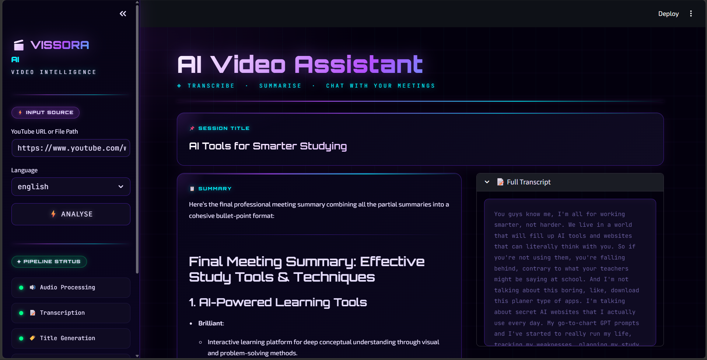

<<<<<<< HEAD
# 🎬 Vissora AI

**Vissora AI** is an AI-powered video and meeting intelligence assistant that transforms recordings into actionable insights. It automatically transcribes audio, generates concise summaries, extracts key decisions and action items, and enables users to interact with meeting content through a Retrieval-Augmented Generation (RAG) chatbot.

---

## 🚀 Features

### 🎙️ Speech-to-Text Transcription

* Transcribes audio from YouTube videos and local media files.
* Supports English transcription using OpenAI Whisper.
* Supports Hinglish transcription and translation using Sarvam AI.

### 📋 AI-Powered Summarization

* Generates concise meeting summaries.
* Produces meaningful session titles automatically.

### 🔍 Insight Extraction

* Extracts:

  * ✅ Action Items
  * 🔑 Key Decisions
  * ❓ Open Questions

### 🧠 Retrieval-Augmented Generation (RAG)

* Converts transcripts into vector embeddings.
* Stores embeddings in ChromaDB.
* Allows users to ask questions about meeting content using natural language.

### 💬 Interactive Chat Interface

* Chat with your meeting transcript.
* Retrieve context-aware answers from recorded discussions.

### 🎨 Modern Streamlit Dashboard

* Clean and responsive UI.
* Real-time processing pipeline visualization.
* Interactive transcript and chat experience.

---

## 🏗️ System Architecture

```text
Video / Audio Input
        │
        ▼
Audio Processing
        │
        ▼
Speech-to-Text (Whisper / Sarvam)
        │
        ▼
Transcript Generation
        │
        ├─────────────► Title Generation
        │
        ├─────────────► Summarization
        │
        ├─────────────► Action Item Extraction
        │
        ├─────────────► Key Decision Extraction
        │
        └─────────────► Question Extraction
        │
        ▼
Embedding Generation
        │
        ▼
ChromaDB Vector Store
        │
        ▼
RAG Chatbot
        │
        ▼
Interactive Q&A
```

---

## 🛠️ Tech Stack

### AI & NLP

* OpenAI Whisper
* Mistral AI
* LangChain

### RAG & Vector Database

* ChromaDB
* Sentence Transformers
* Hugging Face Embeddings

### Audio Processing

* yt-dlp
* FFmpeg
* pydub

### Frontend

* Streamlit

### Utilities

* Python
* NumPy
* Requests
* Python Dotenv

---

## 📂 Project Structure

```text
Vissora-AI/
│
├── app.py
├── main.py
├── Requirements.txt
│
├── core/
│   ├── transcriber.py
│   ├── summarizer.py
│   ├── extractor.py
│   └── rag_engine.py
│
├── utils/
│   └── audio_processor.py
│
├── downloads/
│
└── .env
```

---

## ⚙️ Installation

### Clone Repository

```bash
git clone https://github.com/your-username/vissora-ai.git
cd vissora-ai
```

### Create Virtual Environment

```bash
python -m venv venv
```

Windows:

```bash
venv\Scripts\activate
```

Linux/Mac:

```bash
source venv/bin/activate
```

### Install Dependencies

```bash
pip install -r Requirements.txt
```

---

## 🔑 Environment Variables

Create a `.env` file:

```env
MISTRAL_API_KEY=your_mistral_api_key

# Optional
SARVAM_API_KEY=your_sarvam_api_key

# Whisper Model
WHISPER_MODEL=base
```

---

## ▶️ Running the Application

### Streamlit UI

```bash
streamlit run app.py
```

Open:

```text
http://localhost:8501
```

### Command-Line Version

```bash
python main.py
```

---

## 📸 Example Workflow

1. Paste a YouTube URL or local file path.
2. Select language (English / Hinglish).
3. Generate transcript.
4. View:

   * Summary
   * Action Items
   * Key Decisions
   * Open Questions
5. Chat with the meeting using the RAG assistant.

---

---

## 📸 Sample Outputs

### Dashboard Overview



### Meeting Insights & RAG Chat


---


## 🎯 Use Cases

* Meeting Analysis
* Lecture Summarization
* Interview Review
* Podcast Insights
* YouTube Content Analysis
* Team Collaboration

---

## 📈 Future Enhancements

* Speaker Diarization
* PDF Report Export
* Meeting Analytics Dashboard
* Multi-language Support
* Cloud Deployment
* Real-time Meeting Assistant
* Voice-based Q&A

---

## 👨‍💻 Author

**Shreyas**

AI & Machine Learning Enthusiast focused on building practical AI-powered applications using Machine Learning, Generative AI, and Retrieval-Augmented Generation systems.

---

## ⭐ Support

If you found this project useful, consider giving it a ⭐ on GitHub.
=======
# Vissora-AI
Vissora AI** is an AI-powered video and meeting intelligence assistant that transforms recordings into actionable insights. It automatically transcribes audio, generates concise summaries, extracts key decisions and action items, and enables users to interact with meeting content through a Retrieval-Augmented Generation (RAG) chatbot.
>>>>>>> fcbb67a7da634639abb398850b6e319b17de55b9
